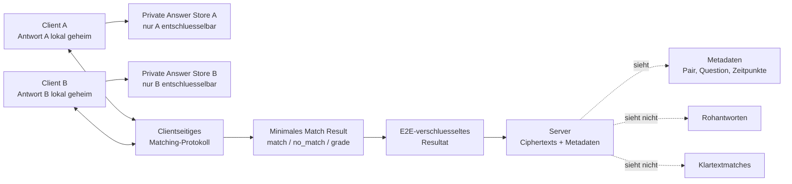

# Sicherheitsarchitektur fuer private Antworten

Stand: 2026-07-12

## Summary

Dieses Dokument beschreibt die Zielarchitektur fuer private Antworten in
TrueDesire. Der Server soll weiterhin blind bleiben, aber Partner-Clients sollen
nicht mehr alle Rohantworten des jeweils anderen Partners entschluesseln koennen.

Der aktuelle Shared-Pair-Key-Ansatz schuetzt Inhalte gegen den Server, aber
nicht gegen den anderen Partner-Client: Beide Partner besitzen denselben
Pair-AES-Key und koennen dadurch technisch alle Antwort-Blobs des Pairs
entschluesseln. Die Zielarchitektur trennt deshalb private Antworten von
gemeinsam sichtbaren Match-Ergebnissen.

## Ist-Zustand

```text
Frage:      AES(pairKey, { text })
Antwort A: AES(pairKey, { answer: "yes" })
Antwort B: AES(pairKey, { answer: "no" })

Client A besitzt pairKey
Client B besitzt pairKey

=> Server sieht keine Klartexte.
=> Beide Partner-Clients koennen alle Antwort-Blobs entschluesseln.
=> Der normale UI-Flow zeigt hauptsaechlich Matches, aber DevTools oder ein
   veraenderter Client koennen Rohantworten des Partners lesen.
```

Der Server speichert fuer Fragen und Antworten nur `EncryptedBlob`-Objekte und
Metadaten. Die Metadaten enthalten unter anderem Pair-ID, Question-ID, User-ID,
Zeitpunkte und `createdBy`.

## Zielzustand

```text
Private Antwort A: nur fuer Client A entschluesselbar
Private Antwort B: nur fuer Client B entschluesselbar

Gemeinsames Ergebnis:
AES(resultKey, { questionId, result: "match" | "no_match", grade? })

=> Partner erhalten keine entschluesselbaren Rohantworten.
=> Gemeinsam gespeichert wird nur ein minimales Match-Ergebnis.
=> Match-Ergebnisse bleiben E2E-verschluesselt.
=> Server sieht weiterhin keine Antworten und keine Klartextmatches.
```

Die Match-Anzeige darf im Zielzustand nicht voraussetzen, dass ein Client die
Rohantwort des Partners entschluesseln kann.

## Architekturdiagramm



## Sicherheitsgrenzen

Das Match-Ergebnis selbst verraet zwangslaeufig Information. Beispiel: Wenn ich
`yes` antworte und `no_match` sehe, kann ich bei einem einfachen
Kompatibilitaetsmodell indirekt auf eine `no`-Antwort des Partners schliessen.

Das Ziel dieser Architektur ist daher nicht "keine Information durch das
Ergebnis", sondern:

- keine direkte Lesbarkeit aller Partnerantworten,
- keine Rohantworten des Partners im normalen Client-Datenfluss,
- kein Serverzugriff auf Antworten oder Klartextmatches,
- explizite Modellierung der unvermeidbaren Ergebnis-Leakage.

## Empfohlene Zielarchitektur

### Phase 1: Dokumentierte Haertung ohne komplexe Kryptografie

- UI und Dokumentation klarstellen: Rohantworten sind im aktuellen Modell
  partnerseitig technisch lesbar.
- Partnerantworten nicht im UI, in Debug-Fallbacks oder in Fehlerszenarien als
  normale lesbare Daten behandeln.
- Match-Ergebnisse als eigenes verschluesseltes Resultat modellieren, auch wenn
  die Rohantworten in dieser Phase noch legacy-kompatibel existieren.
- Security-Dokumentation um das Partner-Client-Angreifermodell erweitern.

### Phase 2: Datenmodell trennen

- `answers` speichert kuenftig keine mit dem Pair-Key entschluesselbaren
  Rohantworten mehr.
- Eigene Antworten werden in einem privaten Client-Store oder als
  nur-fuer-mich verschluesselter Server-Blob gespeichert.
- Eine neue `matchResults`-Datenstruktur speichert nur Ergebnisdaten wie
  `match`, `no_match` und optional `grade`.
- Bestehende Daten werden migrationskompatibel als Legacy-Antworten markiert
  oder in ein neues Modell ueberfuehrt.

### Phase 3: Matching-Protokoll einfuehren

- Fuer v1 pragmatisch: Reveal-on-match oder token-basiertes Matching evaluieren.
- Fuer hohe Sicherheit: Secure Comparison, Private Set Intersection oder OPRF
  als spaetere Architekturentscheidung festhalten.
- Der normale Client-Code darf fuer die Match-Berechnung keine Rohantwort des
  Partners entschluesseln muessen.

## Frage-Herkunft

Frage-Herkunft ist aktuell nicht geheim.

- `createdBy: "computer"` kennzeichnet Systemfragen.
- `createdBy: <userId>` kennzeichnet Fragen eines Partners.
- Clients koennen damit zwischen eigener Frage, Partnerfrage und Systemfrage
  unterscheiden.
- Zusaetzlich enthalten verschluesselte Systemfragen im Payload `systemId` und
  `systemHash`, damit der Client Systemfragen verifizieren kann.

Wenn die Herkunft kuenftig verborgen werden soll, muss `createdBy` durch ein
nicht-offenlegendes Berechtigungsmodell ersetzt oder selbst verschluesselt
werden. Das ist nicht Ziel dieser Antwort-Privatsphaere; kurzfristig bleibt die
Frage-Herkunft sichtbar.

## Akzeptanzkriterien

### Dokumentationsstand

- Dieses Dokument enthaelt Ist-Zustand, Zielzustand, Diagramm, Phasenplan und
  bekannte Leakage-Grenzen.
- Es sagt ausdruecklich, dass der aktuelle Partner-Client Rohantworten lesen
  kann.
- Es sagt ausdruecklich, dass Frage-Herkunft aktuell sichtbar ist.

### Spaetere Implementierung

- Ein Partner-Client kann aus Serverdaten keine Rohantwort des anderen Partners
  entschluesseln.
- Die Match-Anzeige funktioniert ohne Zugriff auf Partner-Rohantworten.
- Der Server speichert keine Klartextantworten und keine Klartextmatches.
- Legacy-Daten werden entweder migriert oder sichtbar als altes Sicherheitsmodell
  behandelt.

## Annahmen

- Dieses Dokument ist ein Architektur- und Migrationsplan, keine sofortige
  Implementierung des neuen Kryptomodells.
- Kurzfristig bleibt die Frage-Herkunft sichtbar.
- Prioritaet ist zuerst, dass Partner nicht mehr alle Rohantworten lesen koennen.
- Vollstaendig kryptografisch starkes Matching wird als spaetere Phase geplant,
  weil es deutlich komplexer ist als das bestehende ECDH/AES-GCM-Modell.
