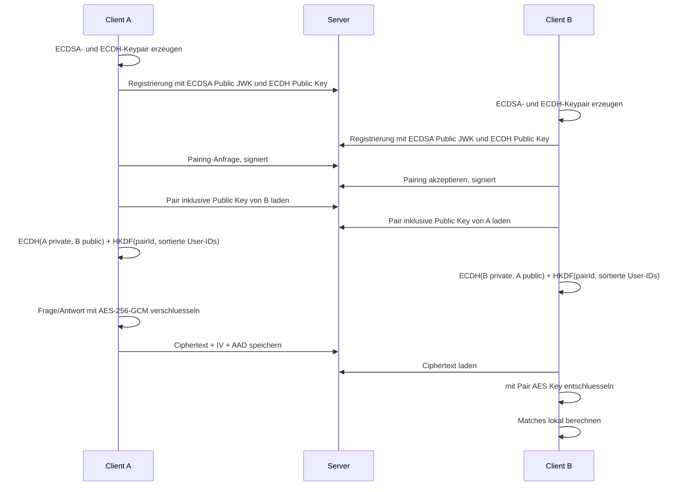

# Sicherheitskonzept

Stand: 2026-07-12

## Ziel

TrueDesire soll so funktionieren, dass der Server keine Fragen, Antworten,
Entscheidungen oder Matches im Klartext lesen kann. Diese Inhalte werden im
Browser verschluesselt und koennen nur von den beiden Partnern eines aktiven
Pairs entschluesselt werden.

Dieses Ziel ist fuer die Inhaltsdaten im aktuellen Code grundsaetzlich
eingehalten: Fragen und Antworten werden als AES-GCM-Ciphertexts gespeichert,
der Pair-Schluessel wird clientseitig per ECDH + HKDF abgeleitet, und Matches
werden clientseitig aus entschluesselten Antworten berechnet. Der Server sieht
jedoch notwendige Metadaten und kann daraus begrenzte Informationen ableiten.

## Trust Boundaries

```text
+---------------------+        HTTPS/API        +----------------------+
| Client A            | <---------------------> | Server               |
| - Private Keys      |                         | - User/Pair-Metadata |
| - Pair AES Key      |                         | - Ciphertext Blobs   |
| - Klartextfragen    |                         | - Antwort-Existenz   |
| - Klartextantworten |                         | - Zeitpunkte         |
+---------------------+                         +----------------------+
          ^
          | ECDH mit Public Key des Partners
          v
+---------------------+
| Client B            |
| - Private Keys      |
| - gleicher AES Key  |
| - Klartextdaten     |
+---------------------+
```

Der Server ist Transport-, Speicher- und Autorisierungsinstanz. Er ist keine
vertrauenswuerdige Instanz fuer Inhaltsvertraulichkeit.

## Datenklassen

| Daten                              | Server sichtbar?                     | Bewertung                             |
| ---------------------------------- | ------------------------------------ | ------------------------------------- |
| Frage-Text                         | Nein, nur `EncryptedBlob`            | E2E-verschluesselt                    |
| Antwort `yes` / `maybe` / `no`     | Nein, nur `EncryptedBlob`            | E2E-verschluesselt                    |
| Match-Ergebnis                     | Nein, nicht serverseitig gespeichert | clientseitig berechnet                |
| User-ID, Nickname, Pairing-Code    | Ja                                   | bewusstes Account-/Pairing-Metadatum  |
| Pair-ID, Partner-Zuordnung         | Ja                                   | fuer Autorisierung noetig             |
| Frage-Ersteller, Antwort-Ersteller | Ja                                   | fuer Berechtigungen und Limits noetig |
| Antwort vorhanden ja/nein          | Ja                                   | Metadaten-Leak                        |
| Zeitpunkte fuer Fragen/Antworten   | Ja                                   | Metadaten-Leak                        |
| Wochenlimit und Verbrauch          | Ja                                   | serverseitige Policy, Metadatum       |
| Public Keys                        | Ja                                   | noetig fuer Auth und ECDH             |
| Private Keys                       | Nein                                 | nur IndexedDB/Backup im Client        |

## Kryptografischer Flow



### Key-Erzeugung

- Der Client erzeugt ein ECDSA-P-256-Keypair fuer API-Signaturen.
- Der Client erzeugt ein ECDH-P-256-Keypair fuer Pair-Schluessel.
- Private Keys werden als JWK in IndexedDB gespeichert und koennen ueber das
  Backup exportiert werden.
- Der Server erhaelt nur `signPublicJwk` und `ecdhPublicRawB64`.

### Pair-Schluessel

Der Pair-Schluessel wird im Client mit WebCrypto abgeleitet:

```text
ECDH secret = ECDH(myEcdhPrivateKey, partnerEcdhPublicKey)
salt        = "love-interests|pair:<pairId>"
info        = "aes-gcm|v1|a:<lowerUserId>|b:<higherUserId>"
AES key     = HKDF-SHA256(ECDH secret, salt, info), AES-GCM-256
```

Dadurch erhalten beide Partner denselben AES-Key. Der Server kann ihn aus den
gespeicherten Public Keys nicht berechnen.

### Inhaltsverschluesselung

- Fragen und Antworten werden als JSON serialisiert.
- Verschluesselung: AES-GCM mit 96-Bit Zufalls-IV.
- AAD bindet Kontext wie Pair-ID, Fragetyp oder Question-ID ein.
- Der Server validiert nur, dass `ciphertextB64`, `ivB64` und `aadB64`
  vorhanden sind. Er kennt den Klartext nicht.

## Match-Flow

```text
1. Client laedt Fragen-Ciphertexts fuer ein Pair.
2. Client laedt Antwort-Ciphertexts fuer dasselbe Pair.
3. Client leitet Pair AES Key ab.
4. Client entschluesselt Fragen und Antworten lokal.
5. Client zeigt nur Fragen als Match, wenn:
   - beide Antworten vorhanden sind,
   - keine Antwort "no" ist.
6. Das Match-Ergebnis wird nicht an den Server gesendet.
```

Damit kann der Server nicht direkt lesen, ob ein Match `perfect`, `maybe` oder
kein Match ist. Er sieht aber, ob beide Partner auf eine Frage geantwortet haben.

## API-Authentifizierung

Alle geschuetzten API-Requests werden vom Client mit ECDSA P-256 signiert. Die
Signatur deckt Methode, Pfad inklusive Query, Timestamp, Nonce und Body-Hash ab.
Der Server prueft die Signatur gegen den gespeicherten Public Key des Users.

Replay-Schutz:

- Zeitfenster: maximal 5 Minuten Abweichung.
- Nonce-Speicher pro User.
- Nonces laufen nach 10 Minuten ab.

## Systemfragen

Systemfragen liegen serverseitig im Klartext in `server/data/system-questions.json`.
Das ist kein Bruch der Partner-Privatsphaere, weil diese Fragen globaler
Kataloginhalt und keine Entscheidung eines Partners sind.

Beim Seed eines aktiven Pairs ruft ein Client die Systemfragen ab, verschluesselt
sie mit dem Pair-Key und speichert nur Ciphertexts im Pair. Der verschluesselte
Payload enthaelt `systemId` und `systemHash`; der Client verifiziert diese Werte
spaeter gegen die aktuelle Systemfragenliste.

## Feststellungen

### OK: Inhalte und Antworten sind nicht serverseitig entschluesselbar

Der Server speichert fuer Fragen und Antworten nur `EncryptedBlob`. Die
serverseitigen Handler erstellen IDs, pruefen Pair-Zugriff und speichern den Blob,
ohne Klartextfelder fuer Frage oder Antwort zu akzeptieren.

### Einschraenkung: Partner-Clients koennen Rohantworten lesen

Das aktuelle Shared-Pair-Key-Modell schuetzt gegen den Server, aber nicht gegen
den anderen Partner-Client. Beide Partner besitzen denselben Pair-AES-Key und
koennen damit technisch alle Antwort-Blobs des Pairs entschluesseln. Die
Zielarchitektur fuer private Antworten ist in `PLAN_SEC.md` beschrieben.

### OK: Matches werden nicht serverseitig berechnet oder gespeichert

Die Match-Berechnung findet im Client statt. Der Server liefert nur Fragen- und
Antwort-Blobs eines Pairs an berechtigte Pair-Mitglieder.

### Einschraenkung: Der Server sieht Metadaten

Der Server kann nicht lesen, welche Antwort gegeben wurde. Er sieht aber:

- welche User gepairt sind,
- wer welche Frage angelegt hat,
- wann Fragen und Antworten gespeichert wurden,
- ob ein bestimmter User auf eine bestimmte Frage geantwortet hat,
- ob eine Frage bereits zwei Antworten hat.

Diese Metadaten reichen nicht zum direkten Lesen von Entscheidungen oder Matches,
koennen aber Verhalten offenlegen, zum Beispiel Aktivitaetsmuster oder dass beide
Partner eine Frage abgeschlossen haben.

### Behoben: Nicht entschluesselbare Antworten duerfen kein Match erzeugen

Die Pruefung hat ergeben, dass die Match-Berechnung eine Antwort, die nicht
entschluesselt werden konnte, urspruenglich als `maybe` behandelt hat. Das war
kryptografisch falsch: Ein manipulierter oder beschaedigter Ciphertext darf
nicht als gueltige Antwort in die Match-Entscheidung eingehen.

Auswirkung:

- Der Server kann die Antwort weiterhin nicht lesen.
- Ein kompromittierter oder fehlerhafter Server koennte aber Ciphertexts
  austauschen oder beschaedigen.
- Der Client konnte daraus falsche `maybe`-Matches anzeigen, statt die Frage als
  nicht verifizierbar zu verwerfen.

Umsetzung:

- Bei Entschluesselungsfehlern wird die betroffene Frage fuer die
  Match-Berechnung uebersprungen.
- Fuer Match-Berechnung werden nur vollstaendig entschluesselte Antworten
  verwendet.
- Optional kann spaeter noch eine Integritaetswarnung im UI angezeigt werden.

### Mittel: Public-Key-Authentizitaet ist serververmittelt

Der Pair AES Key haengt vom ECDH Public Key des Partners ab. Dieser Public Key
wird vom Server ausgeliefert. Es gibt aktuell keine unabhaengige
Key-Verifikation zwischen den Partnern, zum Beispiel Safety Number,
Fingerprint-Vergleich oder QR-Code.

Auswirkung:

- Ein ehrlich arbeitender Server kann Inhalte nicht entschluesseln.
- Ein boesartiger Server koennte beim Pair-Aufbau theoretisch falsche Public Keys
  ausliefern und so einen Man-in-the-Middle-Angriff vorbereiten.
- Bestehende Backups schuetzen nicht gegen eine falsche erste Key-Zuordnung.

Empfehlung:

- Fingerprint des ECDH Public Keys beider Partner anzeigen.
- Partner sollten den Fingerprint ueber einen zweiten Kanal vergleichen koennen.
- Optional: Pairing erst nach beidseitiger Fingerprint-Bestaetigung als
  verifiziert markieren.

### Mittel: Client-Code wird vom Server ausgeliefert

Die Zero-Knowledge-Eigenschaft gilt nur fuer den ausgefuehrten Client-Code. Wenn
derselbe Server die Web-App ausliefert, kann ein kompromittierter Server
theoretisch eine manipulierte JavaScript-Version ausliefern, die Klartext oder
Private Keys exfiltriert.

Empfehlung:

- Production nur ueber HTTPS ausliefern.
- Releases reproduzierbar bauen und versionieren.
- Optional Subresource Integrity, signierte Releases oder installierbare
  vertrauenswuerdige App-Bundles nutzen.
- Strikte Content-Security-Policy ohne Inline-Skripte einfuehren.

### Niedrig: Private Keys und Backups sind unverschluesselt

Private Keys liegen in IndexedDB und der Backup-Export enthaelt die Private Keys
als JSON. Das ist kompatibel mit clientseitiger Entschluesselbarkeit, aber der
Backup-Text ist ein voller Account- und Entschluesselungs-Seed.

Empfehlung:

- Backup-Export optional mit Passwort verschluesseln.
- UI klar als sensitives Geheimnis kennzeichnen.
- Importierte Backups gegen erwartete Struktur und Key-Parameter strenger
  validieren.

### Niedrig: Nonce wird vor Signaturpruefung gespeichert

Der Server speichert eine neue Nonce, bevor die Request-Signatur erfolgreich
verifiziert wurde. Das verhindert keine Entschluesselung, kann aber unnoetige
Writes fuer ungueltige Requests verursachen und unter Last stoeren.

Empfehlung:

- Nonce erst nach erfolgreicher Signaturpruefung final speichern.
- Alternativ Pending-Nonce nur transient halten und nach Verify committen.

### Niedrig: Blob-Schema validiert Base64 und Groessen nicht streng

Das Server-Schema prueft nur, dass Ciphertext, IV und AAD nicht leer sind. Es
erzwingt keine Base64-Gueltigkeit, keine IV-Laenge von 12 Bytes und keine
Payload-Groessenlimits auf Blob-Ebene.

Empfehlung:

- Base64-Format validieren.
- IV-Laenge auf 12 Bytes erzwingen.
- Maximalgroessen fuer Ciphertext und AAD definieren.

## Aussage zur Anforderung

Die Kernanforderung "der Server soll keine Entscheidungen oder Matches lesen
koennen" ist fuer den normalen, ehrlich arbeitenden Server erfuellt:

- Entscheidungen stehen nur im verschluesselten Antwort-Payload.
- Der Server speichert kein Match-Ergebnis.
- Die Entschluesselung und Match-Berechnung passiert im Client.
- Der Pair-Schluessel wird nicht an den Server gesendet.

Nicht vollstaendig abgedeckt sind staerkere Angreifermodelle:

- boesartiger Server beim Ausliefern von Partner-Public-Keys,
- boesartiger Server beim Ausliefern des Web-Clients,
- Manipulation von Ciphertexts mit fehlerhafter Client-Fallback-Logik,
- Metadatenanalyse.

## Priorisierte Massnahmen

1. Partner-Key-Fingerprint anzeigen und verifizierbar machen.
2. Backup-Dateien optional passwortbasiert verschluesseln.
3. Blob-Validierung und Groessenlimits serverseitig haerten.
4. CSP und Release-Integritaet fuer den Web-Client einfuehren.
5. Nonce-Speicherung nach erfolgreicher Signaturpruefung verschieben.
6. Optional eine UI-Integritaetswarnung fuer unentschluesselbare Pair-Daten
   anzeigen.
